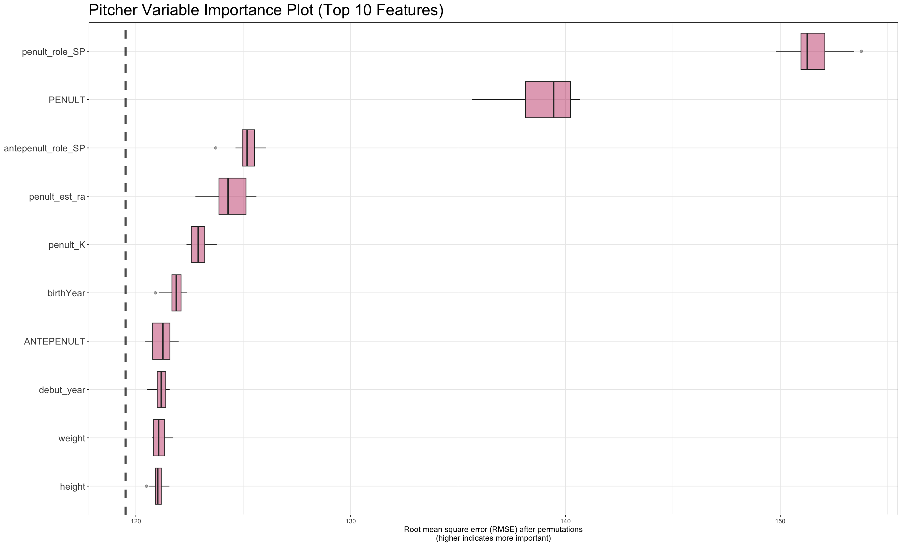
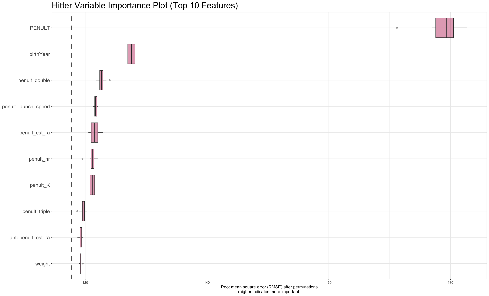

# Predicting Future Playing Time

### By Kevin Baer

## Introduction

The task at hand was to predict future playing time from past statistics. A key challenge is that the largest factor to predicting this outcome is injuries. Unfortunately, with a few rare exceptions, long-term injuries seem quite random, and certainly difficult to predict with traditional baseball statistics. Thankfully, this impacts all the competitors, and likely contributes to the RMSE being about 150 for the top public scores. This is hard! And likely why the Reds posed this question!

## **Defining the Project**

I do not claim to be an expert on baseball. Therefore I decided that it would be silly to try to out feature-engineer other teams with more baseball knowledge. Instead I thought I could take advantage of the unique format of the entries to organize my data better and run my model with higher efficacy. To do this, I wanted to build a model to predict 2023 results from 2022 and 2021 data, and then run the model on the 2023 and 2022 data to predict 2024. There is some data loss here, in the sense that I am not using the 2021 data to predict the 2024 details. If one were using a linear model or something a bit "cleaner", they might be able to more easily incorporate the 2021 data in as a lower weighted version of the 2023 and 2022 coefficients. However, after trying a variety of models, the best performing for both hitters and pitchers was XGBoost so that's what I stuck with.

After deciding on the structure of my training data, I encountered a problem — some players[^1] in the submission file did not play in 2023 and 2022 but did in 2021. Here, it made sense to use the 2021 data, since it would add a lot of info to the players profile. I decided I would sub in the 2021 data for 2022 and just multiply the prediction by two-thirds to account for the skipped years. This was a rather arbitrary system, but seemed like a good and simple way to use my model for this extremely limited population.

[^1]: If I remember correctly it was 17 players.

Ultimately, I made \~5 submissions. Here's an explanation of the differences.

1)  Just a copy of the sample submission (thanks Baasil!)

2)  Simple Random Forest and XGBoost model with Lahman Data and previous year playing time

3)  Added Feature Engineering (see below) from the Savant data

4)  Switched from a grid of 25 to 50 as I finalized the process

5)  Fixed a mistake that was limiting the fitting of the finished model for predictions

## **Feature Engineering**

The baseball savant data provides a lot of feature engineering possibilities. I chose to keep things simple, picking out columns that contained useful information and taking the average per player. For categorical variables like launch_speed_angle, I did one hot encoding and took the average to see how often this event occured. Variable names starting with "penult\_"[^2] are from the year before the prediction (the training 2022 data or predictions 2023 data). Likewise, "antepenult\_"[^3] represents two years before the prediction (the training 2021 data or predictions 2022 data). This allows easy switching back and forth between training and prediction, despite the data coming from different years. Unsurprisingly, the penultimate columns were more useful than the antepenultimate columns. However, both added to the model success.

[^2]: Short for penultimate or second to last

[^3]: Short for antepenultimate or third to last.

## **Analysis**

Here are the top 10 features for my pitcher model, using Permutation Based Variable Importance.

The most important feature, by far, is the pitcher's last season role. If they were often a starting pitcher, this suggests they will pitch starting pitcher reps in the future. It's intriguing that this was more important than the `PENULT` category (or the previous season batters faced). This might show that the role tag helps re-adjust for those who were injuried in the previous season, threw less pitches, and then return the next season to a regular starters workload. In 4th, the penultimate estimated runs added, which is just the average of the `delta_run_exp` variable. This statistic might help identify pitchers who were really good, or really bad, and thus are in line for a performance adjustment to their opportunities. The same can be said for the `penult_K` category. The `birthYear` and `debut_year` help us see where players are on the aging curve, allowing for older players to be phased out, and younger players to be phased in. Finally, `weight` and `height` are potentially useful for injury reasons. Heavier and taller pitchers might be more likely to throw the ball harder, thus potentially more injuries? Just a theory! As will be discussed later, I was certainly surprised to see height and weight on the list of top 10 most important features.

The hitters VIP is a bit clearer. The most important variable is their last season at bats, and it's not particularly close. It's obvious that the saying "the best predictor of success performance is past performance" holds true here. Players who play a lot will continue to play a lot, with a few noteworthy adjustments. As discussed with pitchers, `birthYear` helps with the age curve transitions, allowing for lower numbers for old players and higher numbers for young players as expected. The third place variable is really interesting though — `penult_double` or the rate in which they hit a double. Perhaps doubles represent players who hit the ball really well, they are much more common than triples, slightly more common than home runs, and more impactful than singles. The next group of five, from `penult_launch_speed` down to `antepenult_est_ra` all try to answer the question of "How good is this player?" But then, in tenth place, is `weight`. For hitters, I think the explanation is pretty simple, heavier players likely play 1B/DH/catcher, and these positions seem more commonly rotated or platooned due to their high focus on hitting statistics. It would be interesting to try and add a position variable in, and see whether this would overtake weight as an important measure.

## Results

Obviously, as of writing this, I do not have the private leaderboard scores. However, my public leaderboard score is an RMSE of 155.132, and if I had to guess, this will improve a bit on the private leaderboard. I'm pretty happy with this performance, which is about in line with what my testing would indicate. Interestingly enough, I seemed to score better on the pitchers than the hitters. I think this is because pitchers have more concrete roles (starters v. relievers) and injuries might be a bit more consistent. Hitters, however, have more competition, can be role players, and injuries can be very variable from short to long. I think to improve on this, it would be important to consider other factors like position versatility, fielding statistics, and potentially even hitting percentages vs LHP and RHP for platooning. As for the above insights, I think front offices can learn a lot from looking at which variables were the most helpful at predicting playing time for the following years, as it suggests these stats are somewhat "stable" to a player's performance level. One in particular, was the importance of the double rate for hitters which scored better than the estimated runs added, estimated batting average, and estimated wOBA from launch angle and exit velocity.

## Future Work

I think there are certain variables that would be better by taking a certain percentile (like 90th) such as `release_spin_rate` or `release_speed`. I believe that a players ability level and potentially some sort of higher injury rate would be more obvious this way rather than taking an average. I also would like to work on a better way to use the 2021 data in the final predictions as well. I would need to learn more about this but it feels like it should be possible! Finally, I can't wait to read through other submissions to see various other ways to improve. I'm also excited to learn more about how the Kaggle public/private leaderboard works, given it appears other submissions have taken different approaches from mine.

## **Appendix**

By Kevin Baer, UCLA Second Year Undergraduate Student

Thank you so for much reading! I hope you enjoyed.

Please get in contact with me through my [LinkedIn](https://www.linkedin.com/in/kevinmbaer/) or <a href="mailto:kevinbaer@ucla.edu"> Email</a> with any questions or comments!

Citations, Code, and Commentary \@ my [Github](https://github.com/kevbaer/Reds_Hack_25)!
